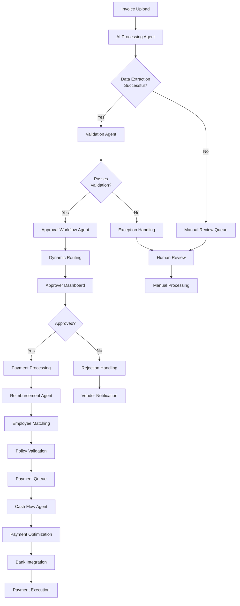

# 🤖 Agentic Flows & Invoicing/Billing Enhancement Plan
## Bilo.finance - AI-Powered Invoice Processing System

---

## 📋 Table of Contents
1. [Current System Analysis](#current-system-analysis)
2. [Suggested Agentic Flows](#suggested-agentic-flows)
3. [System Architecture Overview](#system-architecture-overview)
4. [Implementation Plan](#implementation-plan)
5. [Technical Architecture](#technical-architecture)
6. [Database Schema Enhancements](#database-schema-enhancements)
7. [API Structure](#api-structure)
8. [Expected Benefits](#expected-benefits)
9. [Quick Wins](#quick-wins)
10. [Implementation Timeline](#implementation-timeline)

---

## 🔍 Current System Analysis

### Existing Features
- **Invoice Upload**: PDF/Image upload with drag-and-drop interface
- **Invoice Management**: Basic CRUD operations with search and filtering
- **Reimbursement Processing**: Employee reimbursement tracking and approval
- **Dashboard Analytics**: Basic stats and recent activity tracking
- **User Authentication**: Supabase-based auth system
- **Responsive UI**: Modern React/Next.js interface with dark mode

### Current Tech Stack
- **Frontend**: Next.js 14, React 18, TypeScript, Tailwind CSS
- **Backend**: Supabase (PostgreSQL + Edge Functions)
- **File Handling**: React Dropzone
- **Icons**: React Icons (Feather)
- **State Management**: React Context

### Identified Gaps
- Limited AI-powered data extraction
- Manual approval workflows
- Basic reimbursement matching
- No predictive analytics
- Minimal automation in processing pipeline

---

## 🤖 Suggested Agentic Flows

### 1. **Intelligent Invoice Processing Agent**
**Purpose**: Automate the complete invoice data extraction and validation process

**Capabilities**:
- **Advanced OCR + AI Extraction**: Extract vendor details, amounts, dates, line items, tax information
- **Multi-format Support**: Handle PDFs, images, scanned documents, and digital invoices
- **Data Validation**: Cross-reference against vendor databases and historical data
- **Anomaly Detection**: Flag unusual amounts, duplicate invoices, suspicious patterns
- **Smart Categorization**: Auto-categorize by department, project, budget code
- **Confidence Scoring**: Provide reliability scores for extracted data

**Workflow**:
```
Invoice Upload → OCR Processing → Data Extraction → Validation → Categorization → Queue for Approval
```

### 2. **Dynamic Approval Workflow Agent**
**Purpose**: Intelligently route invoices through approval chains based on business rules

**Capabilities**:
- **Rule-Based Routing**: Route based on amount thresholds, departments, vendor types
- **Context-Aware Notifications**: Send personalized approval requests with relevant context
- **Escalation Management**: Auto-escalate overdue approvals to supervisors
- **Parallel Processing**: Handle multiple approval paths simultaneously
- **Compliance Checking**: Ensure adherence to regulatory and company policies
- **Bulk Operations**: Enable batch approvals for similar invoices

**Workflow**:
```
Processed Invoice → Rule Evaluation → Approver Assignment → Notification → Approval Decision → Next Step
```

### 3. **Smart Reimbursement Processing Agent**
**Purpose**: Automatically match and process employee reimbursements

**Capabilities**:
- **Intelligent Matching**: Match employee receipts with corporate invoices
- **Policy Enforcement**: Apply expense policies and spending limits automatically
- **Multi-currency Handling**: Convert currencies with real-time exchange rates
- **Receipt Validation**: Verify receipt authenticity and completeness
- **Batching Optimization**: Group reimbursements for efficient payment processing
- **Mileage Calculation**: Auto-calculate travel expenses and mileage

**Workflow**:
```
Employee Receipt → Invoice Matching → Policy Check → Approval Queue → Payment Processing
```

### 4. **Cash Flow Prediction Agent**
**Purpose**: Provide intelligent financial forecasting and payment optimization

**Capabilities**:
- **Payment Forecasting**: Predict cash outflows based on invoice due dates
- **Vendor Payment Analysis**: Track payment patterns and suggest optimal timing
- **Budget Impact Analysis**: Show how pending invoices affect budget allocations
- **Liquidity Recommendations**: Suggest payment scheduling to optimize cash flow
- **Seasonal Adjustments**: Account for business seasonality in predictions
- **Risk Assessment**: Identify potential cash flow risks and mitigation strategies

**Workflow**:
```
Invoice Data → Pattern Analysis → Forecast Generation → Optimization Recommendations → Dashboard Updates
```

### 5. **Vendor Relationship Management Agent**
**Purpose**: Optimize vendor interactions and performance monitoring

**Capabilities**:
- **Performance Tracking**: Monitor invoice accuracy, delivery times, compliance rates
- **Communication Automation**: Send payment confirmations, dispute notifications
- **Contract Compliance**: Ensure invoices match contracted terms and rates
- **Vendor Onboarding**: Streamline new vendor setup with automated data collection
- **Relationship Scoring**: Develop vendor relationship health scores
- **Negotiation Insights**: Provide data for vendor contract negotiations

**Workflow**:
```
Vendor Data → Performance Analysis → Relationship Scoring → Automated Communications → Insights Generation
```

### 6. **Fraud Detection & Security Agent**
**Purpose**: Protect against fraudulent invoices and financial threats

**Capabilities**:
- **Pattern Recognition**: Identify suspicious invoice patterns and behaviors
- **Duplicate Detection**: Advanced algorithms to catch duplicate submissions
- **Vendor Verification**: Real-time vendor authenticity checks
- **Amount Anomaly Detection**: Flag unusual amounts or frequency patterns
- **Document Authenticity**: Verify document integrity and detect alterations
- **Risk Scoring**: Assign risk scores to invoices and transactions

**Workflow**:
```
Invoice Processing → Security Scan → Risk Assessment → Flag/Approve → Audit Trail
```

---

## 🏗️ System Architecture Overview



---

## 📅 Implementation Plan

### **Phase 1: Enhanced Invoice Processing (Weeks 1-4)**

#### Week 1-2: AI-Powered OCR Enhancement
- **Integrate Advanced OCR Service**
  - Implement Azure Document Intelligence or AWS Textract
  - Build custom models for common invoice formats
  - Create confidence scoring algorithms
  - Add support for multiple languages

- **Data Extraction Pipeline**
  - Develop structured data extraction from unstructured documents
  - Implement field validation and formatting
  - Create extraction accuracy metrics
  - Build fallback mechanisms for low-confidence extractions

#### Week 3-4: Smart Validation System
- **Vendor Database Enhancement**
  - Create comprehensive vendor management system
  - Implement vendor verification workflows
  - Build vendor performance tracking
  - Add contract terms validation

- **Duplicate Detection**
  - Implement fuzzy matching algorithms
  - Create hash-based duplicate detection
  - Build temporal duplicate checking
  - Add manual override capabilities

- **Policy Enforcement**
  - Digitize company expense policies
  - Create rule-based validation engine
  - Implement spending limit checks
  - Build policy exception workflows

### **Phase 2: Intelligent Workflow Management (Weeks 5-8)**

#### Week 5-6: Dynamic Approval Routing
- **Rule Engine Development**
  - Build flexible rule configuration system
  - Implement conditional routing logic
  - Create approval hierarchy management
  - Add delegation and backup approver features

- **Workflow Orchestration**
  - Develop multi-step approval processes
  - Implement parallel and sequential approval paths
  - Create workflow visualization tools
  - Build workflow performance analytics

#### Week 7-8: Real-time Notifications & Dashboard
- **Notification System**
  - Integrate email/SMS notification services
  - Build in-app notification center
  - Implement push notifications for mobile
  - Create notification preference management

- **Enhanced Dashboard**
  - Develop approval queue with priority scoring
  - Build real-time analytics dashboards
  - Implement bulk approval capabilities
  - Create mobile-responsive approval interface

### **Phase 3: Advanced Reimbursement System (Weeks 9-12)**

#### Week 9-10: Employee-Invoice Matching
- **Smart Matching Algorithms**
  - Develop receipt-to-invoice correlation
  - Implement ML-based matching suggestions
  - Create manual matching interface
  - Build matching confidence scoring

- **Employee Integration**
  - Develop employee profile management
  - Create expense category preferences
  - Implement role-based access controls
  - Build employee analytics dashboards

#### Week 11-12: Payment Optimization
- **Payment Processing Enhancement**
  - Create payment batching algorithms
  - Implement payment scheduling optimization
  - Build vendor payment preferences
  - Add payment method selection logic

- **Financial Integration**
  - Integrate with banking APIs
  - Implement payment execution workflows
  - Create payment reconciliation tools
  - Build payment audit trails

### **Phase 4: Predictive Analytics & Intelligence (Weeks 13-16)**

#### Week 13-14: Cash Flow Forecasting
- **Prediction Models**
  - Build payment prediction algorithms
  - Implement budget impact analysis
  - Create liquidity management tools
  - Develop scenario planning capabilities

- **Financial Analytics**
  - Create spending trend analysis
  - Build department-wise budget tracking
  - Implement cost center analytics
  - Develop ROI measurement tools

#### Week 15-16: Advanced Intelligence Features
- **Anomaly Detection**
  - Implement fraud detection algorithms
  - Build spending pattern analysis
  - Create intelligent alerting systems
  - Develop risk assessment models

- **Vendor Analytics**
  - Build vendor performance dashboards
  - Implement compliance tracking
  - Create vendor risk scoring
  - Develop contract optimization insights

---

## 🛠️ Technical Architecture

### **Microservices Architecture**

```typescript
// Core Services Structure
interface ServiceArchitecture {
  // Core Services
  invoiceProcessingService: {
    ocrEngine: 'Azure Document Intelligence' | 'AWS Textract';
    extractionModels: MLModel[];
    validationRules: ValidationRule[];
    confidenceThreshold: number;
  };
  
  workflowEngine: {
    ruleEngine: BusinessRuleEngine;
    approvalChains: ApprovalChain[];
    escalationRules: EscalationRule[];
    notifications: NotificationService;
  };
  
  reimbursementService: {
    matchingAlgorithms: MatchingAlgorithm[];
    policyEngine: PolicyEngine;
    paymentProcessor: PaymentProcessor;
    employeeIntegration: EmployeeService;
  };
  
  analyticsService: {
    predictionModels: PredictionModel[];
    reportingEngine: ReportingEngine;
    dashboardService: DashboardService;
    dataWarehouse: DataWarehouse;
  };
  
  // Supporting Services
  vendorService: VendorManagementService;
  securityService: SecurityService;
  auditService: AuditService;
  integrationService: IntegrationService;
}
```

### **Enhanced Component Architecture**

```typescript
// Frontend Component Structure
interface ComponentArchitecture {
  // Core Components
  invoiceUpload: {
    dragDropZone: React.Component;
    ocrViewer: React.Component;
    extractionEditor: React.Component;
    confidenceIndicator: React.Component;
  };
  
  approvalWorkflow: {
    approvalQueue: React.Component;
    bulkApprovalTools: React.Component;
    approvalHistory: React.Component;
    workflowVisualizer: React.Component;
  };
  
  analytics: {
    cashFlowForecast: React.Component;
    spendingAnalytics: React.Component;
    vendorDashboard: React.Component;
    budgetTracking: React.Component;
  };
  
  // Shared Components
  smartSearch: React.Component;
  notifications: React.Component;
  mobileInterface: React.Component;
  reportBuilder: React.Component;
}
```

---

## 🗄️ Database Schema Enhancements

### **Core Tables**

```sql
-- Enhanced invoice table
CREATE TABLE invoices (
  id UUID PRIMARY KEY DEFAULT gen_random_uuid(),
  invoice_number VARCHAR(100) UNIQUE NOT NULL,
  vendor_id UUID REFERENCES vendors(id),
  amount DECIMAL(12,2) NOT NULL,
  currency VARCHAR(3) DEFAULT 'USD',
  invoice_date DATE NOT NULL,
  due_date DATE,
  received_date TIMESTAMP DEFAULT NOW(),
  status invoice_status DEFAULT 'pending',
  approval_status approval_status DEFAULT 'pending',
  payment_status payment_status DEFAULT 'unpaid',
  
  -- AI Processing Data
  ai_confidence_score DECIMAL(3,2),
  extraction_method VARCHAR(50),
  extracted_data JSONB,
  validation_flags JSONB,
  
  -- File Management
  original_file_path TEXT,
  processed_file_path TEXT,
  file_hash VARCHAR(64),
  
  -- Audit Fields
  created_by UUID REFERENCES users(id),
  updated_by UUID REFERENCES users(id),
  created_at TIMESTAMP DEFAULT NOW(),
  updated_at TIMESTAMP DEFAULT NOW()
);

-- Vendors table
CREATE TABLE vendors (
  id UUID PRIMARY KEY DEFAULT gen_random_uuid(),
  name VARCHAR(255) NOT NULL,
  legal_name VARCHAR(255),
  tax_id VARCHAR(50),
  address JSONB,
  contact_info JSONB,
  payment_terms INTEGER DEFAULT 30,
  payment_methods JSONB,
  
  -- Performance Metrics
  avg_invoice_accuracy DECIMAL(3,2),
  avg_processing_time INTEGER,
  compliance_score DECIMAL(3,2),
  risk_score DECIMAL(3,2),
  
  -- Status
  status vendor_status DEFAULT 'active',
  onboarding_completed BOOLEAN DEFAULT FALSE,
  
  created_at TIMESTAMP DEFAULT NOW(),
  updated_at TIMESTAMP DEFAULT NOW()
);

-- Approval workflows
CREATE TABLE approval_workflows (
  id UUID PRIMARY KEY DEFAULT gen_random_uuid(),
  invoice_id UUID REFERENCES invoices(id),
  workflow_template_id UUID REFERENCES workflow_templates(id),
  current_step INTEGER DEFAULT 1,
  total_steps INTEGER,
  status workflow_status DEFAULT 'pending',
  
  created_at TIMESTAMP DEFAULT NOW(),
  completed_at TIMESTAMP
);

-- Approval steps
CREATE TABLE approval_steps (
  id UUID PRIMARY KEY DEFAULT gen_random_uuid(),
  workflow_id UUID REFERENCES approval_workflows(id),
  step_number INTEGER NOT NULL,
  approver_id UUID REFERENCES users(id),
  approver_type approval_type, -- 'user', 'role', 'amount_based'
  
  status step_status DEFAULT 'pending',
  decision approval_decision,
  comments TEXT,
  deadline TIMESTAMP,
  
  decided_at TIMESTAMP,
  decided_by UUID REFERENCES users(id)
);

-- Reimbursements
CREATE TABLE reimbursements (
  id UUID PRIMARY KEY DEFAULT gen_random_uuid(),
  invoice_id UUID REFERENCES invoices(id),
  employee_id UUID REFERENCES employees(id),
  amount DECIMAL(10,2) NOT NULL,
  currency VARCHAR(3) DEFAULT 'USD',
  
  -- Matching Information
  matching_confidence DECIMAL(3,2),
  matching_method VARCHAR(50),
  receipt_data JSONB,
  
  -- Categories and Tags
  expense_category VARCHAR(100),
  department VARCHAR(100),
  project_code VARCHAR(50),
  cost_center VARCHAR(50),
  
  status reimbursement_status DEFAULT 'pending',
  processed_at TIMESTAMP,
  paid_at TIMESTAMP,
  
  created_at TIMESTAMP DEFAULT NOW()
);

-- AI Processing Logs
CREATE TABLE ai_processing_logs (
  id UUID PRIMARY KEY DEFAULT gen_random_uuid(),
  invoice_id UUID REFERENCES invoices(id),
  processing_step VARCHAR(50) NOT NULL,
  confidence_score DECIMAL(3,2),
  extracted_fields JSONB,
  validation_results JSONB,
  processing_time_ms INTEGER,
  error_details JSONB,
  
  processed_at TIMESTAMP DEFAULT NOW()
);

-- Workflow Templates
CREATE TABLE workflow_templates (
  id UUID PRIMARY KEY DEFAULT gen_random_uuid(),
  name VARCHAR(255) NOT NULL,
  description TEXT,
  conditions JSONB, -- JSON rules for when to apply this template
  steps JSONB, -- Array of step definitions
  
  is_active BOOLEAN DEFAULT TRUE,
  created_by UUID REFERENCES users(id),
  created_at TIMESTAMP DEFAULT NOW()
);

-- Analytics and Forecasting
CREATE TABLE cash_flow_forecasts (
  id UUID PRIMARY KEY DEFAULT gen_random_uuid(),
  forecast_date DATE NOT NULL,
  forecast_period VARCHAR(20), -- 'weekly', 'monthly', 'quarterly'
  
  predicted_inflow DECIMAL(12,2),
  predicted_outflow DECIMAL(12,2),
  confidence_interval JSONB,
  
  actual_inflow DECIMAL(12,2),
  actual_outflow DECIMAL(12,2),
  
  generated_at TIMESTAMP DEFAULT NOW()
);
```

### **Enums and Types**

```sql
-- Status Enums
CREATE TYPE invoice_status AS ENUM ('pending', 'processing', 'processed', 'error', 'rejected');
CREATE TYPE approval_status AS ENUM ('pending', 'approved', 'rejected', 'escalated');
CREATE TYPE payment_status AS ENUM ('unpaid', 'scheduled', 'processing', 'paid', 'failed');
CREATE TYPE vendor_status AS ENUM ('active', 'inactive', 'pending', 'suspended');
CREATE TYPE workflow_status AS ENUM ('pending', 'in_progress', 'completed', 'cancelled');
CREATE TYPE step_status AS ENUM ('pending', 'completed', 'skipped', 'escalated');
CREATE TYPE approval_decision AS ENUM ('approved', 'rejected', 'escalated');
CREATE TYPE approval_type AS ENUM ('user', 'role', 'amount_based', 'department');
CREATE TYPE reimbursement_status AS ENUM ('pending', 'approved', 'rejected', 'paid');
```

### **Indexes for Performance**

```sql
-- Performance Indexes
CREATE INDEX idx_invoices_status ON invoices(status);
CREATE INDEX idx_invoices_vendor_date ON invoices(vendor_id, invoice_date);
CREATE INDEX idx_invoices_amount ON invoices(amount);
CREATE INDEX idx_invoices_due_date ON invoices(due_date) WHERE status != 'paid';

CREATE INDEX idx_approval_workflows_status ON approval_workflows(status);
CREATE INDEX idx_approval_steps_approver ON approval_steps(approver_id, status);
CREATE INDEX idx_approval_steps_deadline ON approval_steps(deadline) WHERE status = 'pending';

CREATE INDEX idx_reimbursements_employee ON reimbursements(employee_id);
CREATE INDEX idx_reimbursements_status ON reimbursements(status);

CREATE INDEX idx_ai_logs_invoice ON ai_processing_logs(invoice_id);
CREATE INDEX idx_ai_logs_step ON ai_processing_logs(processing_step, processed_at);

-- Full-text search indexes
CREATE INDEX idx_vendors_search ON vendors USING gin(to_tsvector('english', name || ' ' || COALESCE(legal_name, '')));
CREATE INDEX idx_invoices_search ON invoices USING gin(to_tsvector('english', invoice_number));
```

---

## 🔌 API Structure

### **Core API Endpoints**

```typescript
interface InvoiceAPI {
  // Invoice Management
  uploadInvoice(file: File, metadata?: InvoiceMetadata): Promise<ProcessedInvoice>;
  processInvoice(invoiceId: string): Promise<ProcessingResult>;
  getInvoice(invoiceId: string): Promise<Invoice>;
  updateInvoice(invoiceId: string, updates: InvoiceUpdate): Promise<Invoice>;
  deleteInvoice(invoiceId: string): Promise<void>;
  
  // Bulk Operations
  bulkUpload(files: File[]): Promise<BulkUploadResult>;
  bulkProcess(invoiceIds: string[]): Promise<BulkProcessResult>;
  bulkApprove(invoiceIds: string[], approverNotes?: string): Promise<BulkApprovalResult>;
  
  // Search and Filtering
  searchInvoices(query: SearchQuery): Promise<PaginatedInvoices>;
  getInvoicesByStatus(status: InvoiceStatus): Promise<Invoice[]>;
  getInvoicesByVendor(vendorId: string): Promise<Invoice[]>;
  getInvoicesByDateRange(startDate: Date, endDate: Date): Promise<Invoice[]>;
}

interface ApprovalAPI {
  // Approval Workflows
  getApprovalQueue(userId: string, filters?: ApprovalFilters): Promise<ApprovalItem[]>;
  approveInvoice(invoiceId: string, decision: ApprovalDecision): Promise<ApprovalResult>;
  rejectInvoice(invoiceId: string, reason: string): Promise<ApprovalResult>;
  escalateApproval(invoiceId: string, reason: string): Promise<ApprovalResult>;
  delegateApproval(invoiceId: string, delegateToUserId: string): Promise<ApprovalResult>;
  
  // Workflow Management
  getWorkflowTemplates(): Promise<WorkflowTemplate[]>;
  createWorkflowTemplate(template: WorkflowTemplateCreate): Promise<WorkflowTemplate>;
  updateWorkflowTemplate(templateId: string, updates: WorkflowTemplateUpdate): Promise<WorkflowTemplate>;
  
  // Approval Analytics
  getApprovalMetrics(userId: string, period: DateRange): Promise<ApprovalMetrics>;
  getWorkflowPerformance(templateId: string): Promise<WorkflowPerformance>;
}

interface ReimbursementAPI {
  // Reimbursement Processing
  getReimbursements(filters?: ReimbursementFilters): Promise<PaginatedReimbursements>;
  processReimbursement(reimbursementId: string): Promise<ProcessingResult>;
  matchReceiptToInvoice(receiptId: string, invoiceId: string): Promise<MatchingResult>;
  
  // Employee Management
  getEmployeeReimbursements(employeeId: string): Promise<Reimbursement[]>;
  createReimbursementRequest(request: ReimbursementRequest): Promise<Reimbursement>;
  updateReimbursementStatus(reimbursementId: string, status: ReimbursementStatus): Promise<Reimbursement>;
  
  // Bulk Processing
  bulkProcessReimbursements(reimbursementIds: string[]): Promise<BulkProcessResult>;
  generatePayrollExport(filters: PayrollFilters): Promise<PayrollExport>;
}

interface AnalyticsAPI {
  // Financial Analytics
  getSpendingAnalytics(filters: AnalyticsFilters): Promise<SpendingAnalytics>;
  getCashFlowForecast(period: DateRange): Promise<CashFlowForecast>;
  getBudgetAnalysis(departmentId?: string): Promise<BudgetAnalysis>;
  getVendorAnalytics(vendorId: string): Promise<VendorAnalytics>;
  
  // Performance Metrics
  getProcessingMetrics(period: DateRange): Promise<ProcessingMetrics>;
  getApprovalMetrics(period: DateRange): Promise<ApprovalMetrics>;
  getUserProductivity(userId: string, period: DateRange): Promise<ProductivityMetrics>;
  
  // Reporting
  generateReport(reportConfig: ReportConfig): Promise<ReportResult>;
  scheduleReport(reportConfig: ReportConfig, schedule: Schedule): Promise<ScheduledReport>;
  getAvailableReports(): Promise<ReportTemplate[]>;
}

interface VendorAPI {
  // Vendor Management
  getVendors(filters?: VendorFilters): Promise<PaginatedVendors>;
  createVendor(vendor: VendorCreate): Promise<Vendor>;
  updateVendor(vendorId: string, updates: VendorUpdate): Promise<Vendor>;
  deactivateVendor(vendorId: string): Promise<void>;
  
  // Vendor Performance
  getVendorPerformance(vendorId: string): Promise<VendorPerformance>;
  getVendorCompliance(vendorId: string): Promise<ComplianceReport>;
  updateVendorPreferences(vendorId: string, preferences: VendorPreferences): Promise<Vendor>;
  
  // Vendor Communication
  sendVendorNotification(vendorId: string, notification: VendorNotification): Promise<void>;
  getVendorCommunicationHistory(vendorId: string): Promise<CommunicationHistory[]>;
}
```

### **Data Transfer Objects**

```typescript
// Core DTOs
interface ProcessedInvoice {
  id: string;
  invoiceNumber: string;
  vendor: VendorInfo;
  amount: number;
  currency: string;
  invoiceDate: Date;
  dueDate?: Date;
  extractedData: ExtractedData;
  confidenceScore: number;
  status: InvoiceStatus;
  approvalStatus: ApprovalStatus;
}

interface ExtractedData {
  vendorName: string;
  vendorAddress?: Address;
  invoiceNumber: string;
  invoiceDate: Date;
  dueDate?: Date;
  totalAmount: number;
  taxAmount?: number;
  currency: string;
  lineItems: LineItem[];
  paymentTerms?: string;
  confidence: FieldConfidence;
}

interface ApprovalItem {
  invoiceId: string;
  invoice: InvoiceInfo;
  currentStep: number;
  totalSteps: number;
  deadline?: Date;
  priority: Priority;
  approvalHistory: ApprovalStep[];
  requiredActions: string[];
}

interface CashFlowForecast {
  period: DateRange;
  predictions: {
    inflow: ForecastData[];
    outflow: ForecastData[];
    netFlow: ForecastData[];
  };
  confidence: number;
  assumptions: string[];
  risks: RiskFactor[];
}

interface VendorPerformance {
  vendorId: string;
  metrics: {
    invoiceAccuracy: number;
    averageProcessingTime: number;
    complianceScore: number;
    paymentTermsAdherence: number;
  };
  trends: PerformanceTrend[];
  recommendations: string[];
}
```

---

## 📊 Expected Benefits

### **Quantitative Benefits**

| Metric | Current State | Target State | Improvement |
|--------|---------------|--------------|-------------|
| Data Entry Time | 15-20 min/invoice | 2-3 min/invoice | **70-80% reduction** |
| Processing Errors | 8-12% error rate | 1-2% error rate | **90% error reduction** |
| Approval Cycle Time | 5-7 days average | 2-3 days average | **60% faster processing** |
| Manual Review Required | 80% of invoices | 20% of invoices | **75% automation rate** |
| Duplicate Payments | 2-3% occurrence | <0.5% occurrence | **85% reduction** |
| Compliance Issues | 15% flagged | 3% flagged | **80% improvement** |

### **Qualitative Benefits**

#### **Operational Excellence**
- **Streamlined Workflows**: Automated routing reduces bottlenecks
- **Enhanced Visibility**: Real-time dashboards provide complete transparency
- **Improved Compliance**: Automated policy enforcement ensures adherence
- **Better Audit Trails**: Complete tracking of all actions and decisions

#### **Strategic Advantages**
- **Cash Flow Optimization**: Predictive analytics enable better financial planning
- **Vendor Relationships**: Improved payment accuracy and timing strengthen partnerships
- **Scalability**: Handle 10x volume increase with same team size
- **Data-Driven Decisions**: Rich analytics support strategic financial decisions

#### **User Experience**
- **Reduced Manual Work**: Staff focus on high-value activities
- **Mobile Accessibility**: Approve invoices from anywhere
- **Intuitive Interfaces**: Easy-to-use dashboards and workflows
- **Proactive Notifications**: Stay informed without constant monitoring

### **ROI Projections**

#### **Year 1 Financial Impact**
- **Cost Savings**: $150,000 in reduced manual processing costs
- **Efficiency Gains**: 2,000 hours saved in manual data entry
- **Error Reduction**: $50,000 saved from prevented duplicate payments
- **Compliance**: $25,000 saved in audit and compliance costs

#### **3-Year Total Benefits**
- **Total Cost Savings**: $500,000+
- **Revenue Impact**: Improved cash flow management worth $200,000+
- **Risk Mitigation**: Fraud prevention worth $100,000+
- **Productivity Gains**: 6,000+ hours redirected to strategic work

---

## 🚀 Quick Wins (Immediate Implementation)

### **Week 1-2: Enhanced OCR Integration**
**Impact**: Immediate 60% reduction in manual data entry
- Integrate Azure Document Intelligence or AWS Textract
- Build confidence scoring for extracted data
- Create extraction validation workflows
- Add support for common invoice formats

### **Week 3-4: Smart Duplicate Detection**
**Impact**: Prevent duplicate payments (2-3% of total payments)
- Implement hash-based duplicate checking
- Add fuzzy matching for similar invoices
- Create manual override workflows
- Build duplicate detection analytics

### **Week 5-6: Automated Approval Routing**
**Impact**: 40% faster approval cycles
- Create rule-based routing system
- Implement amount-based approval thresholds
- Add department-specific approval chains
- Build escalation timers

### **Week 7-8: Real-time Dashboards**
**Impact**: Improved visibility and decision-making
- Create approval queue dashboards
- Build spending analytics views
- Implement real-time status updates
- Add mobile-responsive interfaces

### **Week 9-10: Mobile Approval App**
**Impact**: Enable on-the-go approvals, reducing approval delays
- Build mobile-optimized approval interface
- Implement push notifications
- Add offline capability for basic operations
- Create bulk approval tools

---

## 📈 Implementation Timeline

### **Phase 1: Foundation (Months 1-2)**
```
Month 1:
├── Week 1: OCR Integration & Data Extraction
├── Week 2: Validation System & Duplicate Detection
├── Week 3: Basic Approval Workflows
└── Week 4: Enhanced UI/UX & Mobile Interface

Month 2:
├── Week 5: Advanced Approval Routing
├── Week 6: Notification System & Real-time Updates
├── Week 7: Basic Analytics & Reporting
└── Week 8: Testing & Optimization
```

### **Phase 2: Intelligence (Months 3-4)**
```
Month 3:
├── Week 9: AI-Powered Categorization
├── Week 10: Reimbursement Matching System
├── Week 11: Vendor Management Enhancement
└── Week 12: Payment Processing Integration

Month 4:
├── Week 13: Cash Flow Forecasting
├── Week 14: Advanced Analytics Dashboard
├── Week 15: Anomaly Detection System
└── Week 16: Performance Optimization
```

### **Phase 3: Advanced Features (Months 5-6)**
```
Month 5:
├── Week 17: Machine Learning Model Training
├── Week 18: Predictive Analytics Enhancement
├── Week 19: Advanced Vendor Analytics
└── Week 20: Integration with External Systems

Month 6:
├── Week 21: Security & Fraud Detection
├── Week 22: Advanced Reporting & BI
├── Week 23: API Enhancement & Documentation
└── Week 24: Final Testing & Deployment
```

### **Milestone Deliverables**

#### **Month 1 Deliverables**
- ✅ Enhanced OCR with 90%+ accuracy
- ✅ Automated approval routing
- ✅ Mobile-responsive dashboard
- ✅ Basic duplicate detection

#### **Month 2 Deliverables**
- ✅ Complete workflow automation
- ✅ Real-time notifications
- ✅ Spending analytics dashboard
- ✅ Mobile approval application

#### **Month 3 Deliverables**
- ✅ AI-powered invoice categorization
- ✅ Intelligent reimbursement matching
- ✅ Vendor performance tracking
- ✅ Payment optimization

#### **Month 4 Deliverables**
- ✅ Cash flow forecasting
- ✅ Anomaly detection system
- ✅ Advanced analytics platform
- ✅ Performance optimization

#### **Month 5-6 Deliverables**
- ✅ Machine learning enhancement
- ✅ Predictive analytics
- ✅ Security & fraud detection
- ✅ Complete system integration

---

## 🎯 Success Metrics

### **Key Performance Indicators (KPIs)**

#### **Operational Metrics**
- **Processing Time**: Average time from upload to approval
- **Accuracy Rate**: Percentage of correctly extracted data
- **Automation Rate**: Percentage of invoices processed without manual intervention
- **Approval Cycle Time**: Time from submission to final approval
- **Error Rate**: Percentage of processing errors

#### **Business Metrics**
- **Cost per Invoice**: Total processing cost divided by invoice volume
- **User Satisfaction**: Survey scores from end users
- **Time Savings**: Hours saved through automation
- **Cash Flow Improvement**: Days saved in payment cycles
- **ROI**: Return on investment for the system

#### **Quality Metrics**
- **Data Accuracy**: Accuracy of extracted invoice data
- **Duplicate Detection Rate**: Percentage of duplicates caught
- **Compliance Rate**: Adherence to company policies
- **Vendor Satisfaction**: Feedback from vendor partners
- **Audit Readiness**: Time required for audit preparation

---

This comprehensive plan provides a roadmap for transforming Bilo.finance into a state-of-the-art AI-powered invoicing and billing platform. The agentic flows will significantly reduce manual work, improve accuracy, and provide intelligent insights for better financial management. 